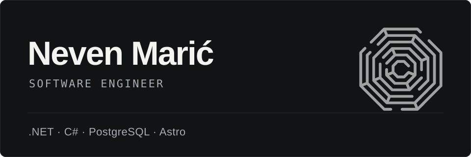

  

## A little about me

I'm a backend software engineer with **5+ years in .NET and C#**, mostly in fintech and healthcare. Places where cutting corners tends to come up in audits, not just code reviews.

My day-to-day stack is **.NET / C# / PostgreSQL**. I'm not looking for a reason to switch it up; I'd rather keep getting better at what I do. In my spare time, I also help create websites for small businesses using **AstroJS**.

## How I think about work

I want to understand why a feature needs to exist and what problem it solves - not just what it needs to do. The context behind a decision matters to me, and I like working with people who are willing to talk it through.

I've balanced a full-time EU engineering role, US-timezone freelance work, and part-time Computer Engineering studies at Zagreb University of Applied Sciences at the same time. **I'm used to keeping work moving even when everyone's working different hours.**

> That doesn't mean being permanently busy is the goal. I value teams that build meaningful products, where people know each other as people and overtime stays the exception.

## Outside of work

Most weekends during summer involve a car meet, Cars & Coffee, or finding something to do with cars. I dabble in car wrapping and detailing for fun, and own a **Mazda RX-8** that I love, even when it tests my patience. 13B all the way!

No grand connection to software engineering here. I just really like cars.

---

**Interested in backend work, small-business websites, or a discussion about questionable car choices?**

